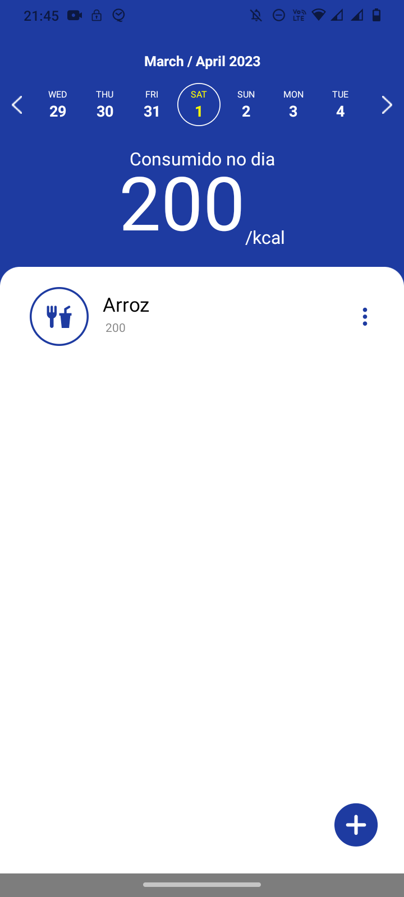
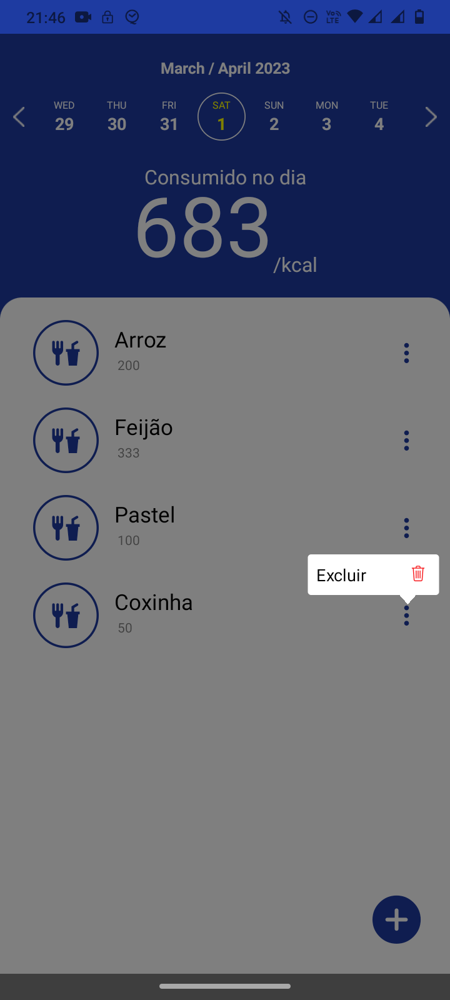
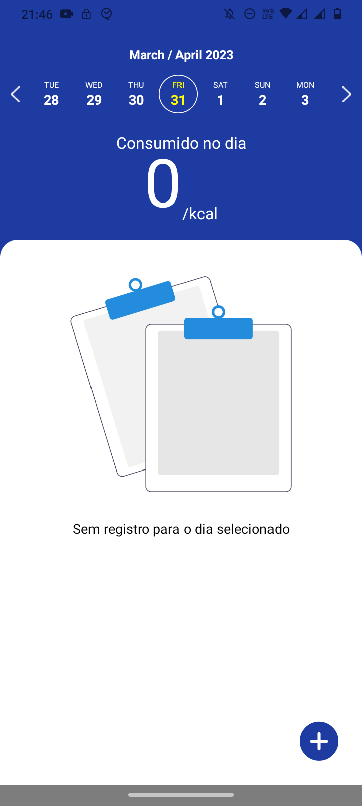
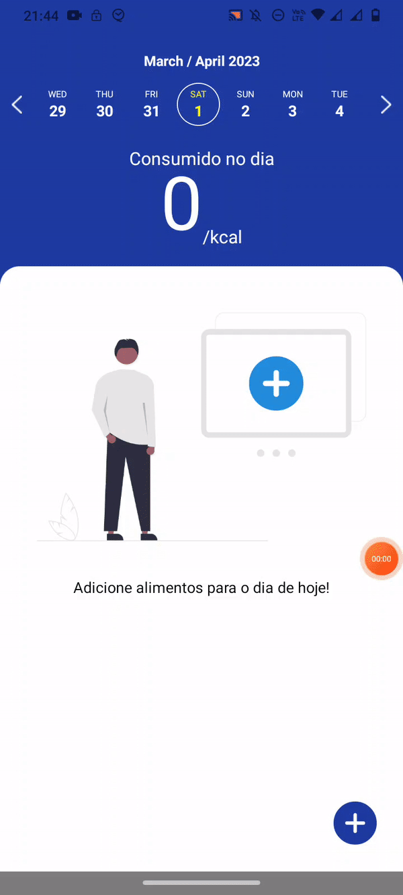

# my-fit-app


App para acompanhamento fitness desenvolvido para fins de estudo. Os dados são persistidos na memória interna do celular para que, com isso, os alimentos cadastrados não se percam após o app ser fechado.

## Screenshots

<p align="center">
    
    
    
</p>

<p align="center">
    
    
</p>

## Tecnologias
- React Native
- Expo
- Async-storage
- styled-components
- E mais...

___

## Instalação

Clone o projeto e acesse a sua pasta: 

```sh
$ git https://github.com/thiagoemanoel98/my-fit-app.git
$ cd my-fit-app
```

Instale as dependências do projeto e inicie:

```sh
# Dependências
$ expo install

# Iniciando...
$ expo start 
```

___

Made with :coffee: by Thiago Emanoel :v:
